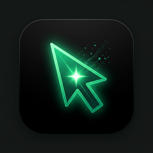

# Locus

**OS-level AI overlay.** Highlight any text anywhere on screen — Locus appears at your cursor, ready to fix, explain, rewrite, or chat. No copy-paste, no tab switching.



---

## What it does

- **Highlight → invoke** — drag-select any text, Locus pops up at your cursor automatically
- **Alt+Space** — invoke at cursor without selecting
- **Chat** — stream responses from your local or cloud LLM
- **Companion panel** — side panel with tabbed modes

### Free features (Ollama or your own API key)

| Feature | What it does |
|---------|-------------|
| **Fix** | Spots bugs, suggests corrections |
| **Optimize** | Performance and readability improvements |
| **Explain** | Plain-language breakdown of any code or text |
| **Review** | Staff-engineer code review |
| **Teach Me** | What / How / Why / Example breakdown |
| **Deep Dive** | Focused technical deep analysis |
| **Rewrite / Simplify** | Prose and code rewriting |
| **Summarize** | Condense any selection |
| **OCR** | Capture a region, extract text, ask about it |
| **Lookup** | Dictionary + Wikipedia + LLM at double-click speed |
| **Multi-provider** | Ollama, OpenAI, Anthropic — switch with one click |
| **Export** | Save conversations as Markdown |

### Requires Manifesto Engine

| Feature | What it does |
|---------|-------------|
| **Blueprint Printer** | Structured technical breakdown (Problem → Design → Implementation → Risks → Tests) |

> **Blueprint is the only feature that needs Manifesto Engine.** Everything else works
> with just Ollama running locally — no account, no subscription.


---

## Install

### Linux (recommended)

Download the latest `.deb` or `.AppImage` from [Releases](https://github.com/SovereignForge/locus/releases).

**deb (Ubuntu / Debian / Pop!_OS):**
```bash
sudo dpkg -i locus_4.2.2_amd64.deb
# First launch sets up Python venv + pynput automatically
locus
```

**AppImage:**
```bash
chmod +x Locus-4.2.2.AppImage
./Locus-4.2.2.AppImage
```

### Requirements

- **Linux:** X11 display server (Wayland not yet supported for mouse hooks)
- **Python 3.8+** — auto-detected; used for pynput highlight listener
- **Ollama** (optional) — for local models: `curl -fsSL https://ollama.ai/install.sh | sh`

---

## First launch

Locus runs a one-time setup in the background on first launch:
1. Creates a Python venv at `~/.local/share/locus/venv`
2. Installs `pynput` for highlight activation
3. Registers autostart entry

A tray icon appears in your system tray. Locus is ready.

---

## Configuration

Config file: `~/.config/locus/config.json`

```json
{
  "provider": "ollama",
  "model": "llama3.2",
  "hotkey": "Alt+Space",
  "highlightActivation": true,
  "providers": {
    "openai": { "apiKey": "sk-..." },
    "anthropic": { "apiKey": "sk-ant-..." }
  }
}
```

> **Never put API keys in the config file if you share your machine.** Set `OPENAI_API_KEY` / `ANTHROPIC_API_KEY` environment variables instead — Locus reads them automatically.

### Switching providers

- **Click the model badge** in the overlay header (e.g. `llama3.2`) to cycle providers
- Or edit `config.json` and restart Locus

### Supported providers

| Provider | Config key | Auto-detected env var |
|----------|------------|----------------------|
| Ollama (local) | `"provider": "ollama"` | — |
| OpenAI | `"provider": "openai"` | `OPENAI_API_KEY` |
| Anthropic | `"provider": "anthropic"` | `ANTHROPIC_API_KEY` |

---

## Companion Panel

The companion panel opens alongside the main overlay (click **⚡ Panels**).

| Tab | What it does |
|-----|-------------|
| **Blueprint** | Structured technical breakdown via Manifesto Engine |
| **Teach Me** | Plain-language What / How / Why / Example |
| **Deep Dive** | Focused, detailed technical analysis |
| **Terminal** | Run shell commands without leaving Locus |

**Push context:** Click **→ Panel** to send the current highlighted text into the active panel tab.

---

## Keyboard shortcuts

| Shortcut | Action |
|----------|--------|
| `Alt+Space` | Invoke Locus at cursor |
| `Escape` | Dismiss overlay |
| `Enter` | Send chat message |
| `Ctrl+Enter` | Send chat message |
| `Ctrl+1–6` | Quick actions (Fix, Explain, Rewrite, Summarize, Tests, Docs) |
| `Ctrl+S` | Capture screenshot |
| `Ctrl+E` | Export conversation as Markdown |

---

## Build from source

```bash
git clone https://github.com/SovereignForge/locus
cd locus
npm install

# Run in dev mode
npm start

# Build packages
npm run build:linux   # AppImage + .deb
npm run build:mac     # .dmg
npm run build:win     # NSIS installer
```

---

## Architecture

```
src/
├── main.js              — Main process (Electron, IPC, window management)
├── index.html           — Main overlay UI (context, actions, chat, streaming)
├── companion-panel.html — Tabbed companion (Blueprint / Teach / Dive / Terminal)
├── toolbar.html         — Floating action toolbar
├── lookup.html          — Dictionary + Wikipedia + LLM lookup
├── platform.js          — Cross-platform abstraction (Linux/Windows)
├── setup.js             — First-launch bootstrapper (venv, pynput, autostart)
└── providers/
    ├── ollama.js        — Local Ollama (streaming)
    ├── openai.js        — OpenAI-compatible API (streaming)
    └── anthropic.js     — Anthropic Claude (streaming)
```

---

## Privacy

- All LLM calls go to your configured provider (local Ollama or cloud API)
- Locus does **not** send telemetry, crash reports, or usage data anywhere
- Highlighted text never leaves your machine unless you explicitly send a request
- CortexDB memory is stored locally in PostgreSQL by default

---

## License

MIT — © Donovan Everitts / SovereignForge
